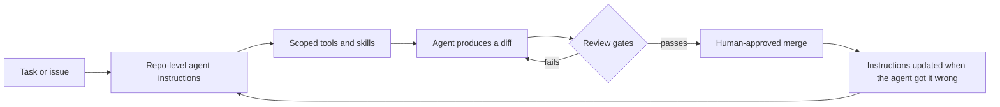

## Ownership
- Owner: marvin Marlik telegram @solidity pope
- Email: marlikkodes@gmail.com

# agentic-engineering-playbook

How a small team runs AI-assisted engineering: agent instructions, skills, tool scoping and review
gates.

This is a working practice, not a position on whether AI should write code. It already does, on
products with users. The question that matters is what has to be true for that code to be safe to
merge — and most of the answer lives in the repository, not in the model.

## The operating model

The loop is the point. An agent that produces a rejected diff and teaches you nothing is a cost;
an agent whose failures get written back into the instructions is a compounding asset.

## Contents

| Document | What it covers |
|----------|----------------|
| [templates/AGENTS.md](templates/AGENTS.md) | A starting agent-instructions file, annotated with why each section exists |
| [docs/tool-scoping.md](docs/tool-scoping.md) | Deciding what an agent may touch, and how to keep that decision small |
| [docs/review-gates.md](docs/review-gates.md) | What must pass before agent-written code merges, and what a human must always read |

## Principles

**Instructions are code.** Agent guidance belongs in the repository, in review, in version history.
If it lives in a chat window or a personal settings file, it is not part of how the team works.

**Scope beats capability.** A narrow tool with a clear contract outperforms a broad one the model
has to reason about. Most bad agent behaviour is a scoping failure, not an intelligence failure.

**The diff is the deliverable.** Judge agents on reviewable changes, not on transcripts. If a change
cannot be reviewed in a normal pull request, it is not finished.

**Humans stay accountable.** The author of a pull request is the person who opened it, whatever wrote
the lines. Attribution language does not transfer responsibility.

**Write down the failures.** Every recurring mistake is either a missing instruction, a missing test,
or a tool that is too broad. Fix the cause, not the individual output.

**Measure cost per completed task.** Tokens, latency and retries are the real unit economics of this
way of working. A cheaper model that needs three attempts is not cheaper.

## Status

This playbook is extracted from a production codebase and is being filled in progressively. Sections
are published when the practice behind them has actually survived contact with a release, not when
the idea sounds good.
